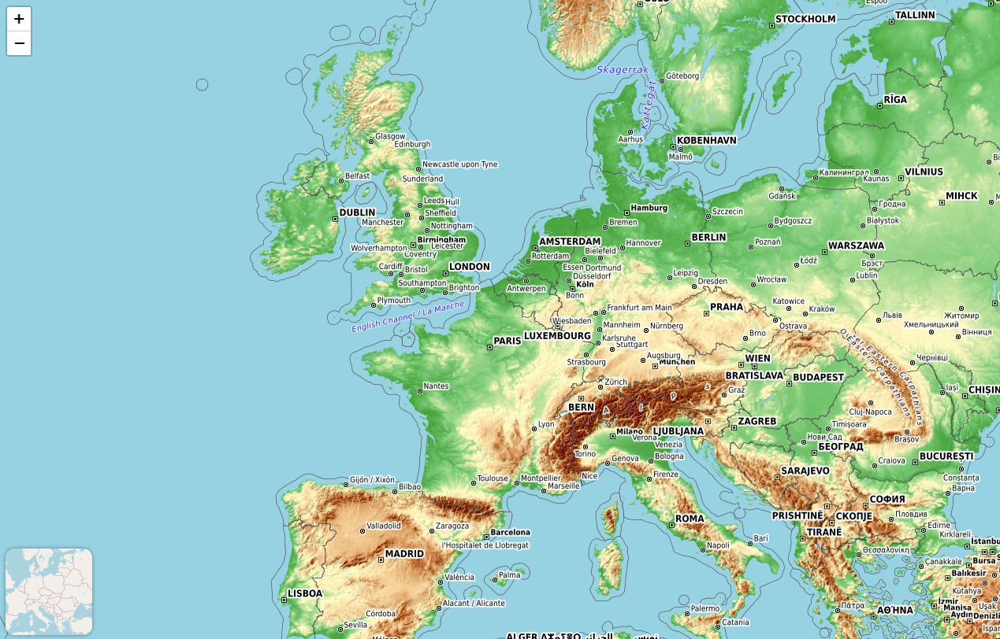

# L.basemapControl

[](https://urban96.github.io/L.basemapControl/examples/example1.html)

L.basemapControl is a Leaflet plugin that adds a control for switching between multiple basemap layers. It allows users to seamlessly toggle between different predefined map layers, providing a synchronized minimap preview of the next basemap in the sequence.

## Features

- **Basemap Switching**: Enables users to easily switch between various basemap layers with a single click. Each basemap layer can be customized with specific tile providers.
- **Layer Preview**: The plugin offers a synchronized minimap that previews the next basemap layer in the sequence. The minimap reflects the current center and zoom level of the main map. Clicking on the minimap changes the active basemap layer to the one shown in the preview.
- **Customizable Control**: The control position and the set of layers can be customized according to the needs of the application. The plugin also handles errors in layer loading and allows for programmatic changes of the active basemap.


## Demo

Check out a live demo of the plugin in action: [examples/example1.html](https://urban96.github.io/L.basemapControl/examples/example1.html)


## Example usage

To use the `L.basemapControl` plugin, follow these steps:

1. **Include the plugin's CSS and JavaScript files** in your HTML file:

    ```html
    <link rel="stylesheet" href="path/to/L.basemapControl.min.css">
    <script src="path/to/L.basemapControl.min.js"></script>
    ```

2. **Initialize the control** on your map with the desired layers:

    ```javascript
    // Initialize the Leaflet map
    var map = L.map('map').setView([51.505, -0.09], 13);


    // Initialize the basemap control
    var basemapControl = L.basemapControl({
        position: 'bottomleft',
        layers: [
            {
                layer: L.tileLayer('https://tile.openstreetmap.org/{z}/{x}/{y}.png', {
                    maxZoom: 19,
                    attribution: '&copy; <a href="https://www.openstreetmap.org/copyright">OpenStreetMap</a> contributors'
                })
            },
            {
                layer: L.tileLayer('https://tileserver.memomaps.de/tilegen/{z}/{x}/{y}.png', {
                    maxZoom: 18,
                    attribution: 'Map <a href="https://memomaps.de/">memomaps.de</a> <a href="http://creativecommons.org/licenses/by-sa/2.0/">CC-BY-SA</a>, map data &copy; <a href="https://www.openstreetmap.org/copyright">OpenStreetMap</a> contributors'
                })
            },
            {
                layer: L.tileLayer('https://{s}.tile.opentopomap.org/{z}/{x}/{y}.png', {
                    maxZoom: 17,
                    attribution: '&copy; <a href="https://www.openstreetmap.org/copyright">OpenStreetMap</a> contributors'
                })
            }
        ]
    }).addTo(map);
    ```

3. **Customize** the `position` and `layers` options as needed for your application.

Make sure you have initialized your Leaflet map and included the plugin’s CSS and JS files before using the `L.basemapControl`.
